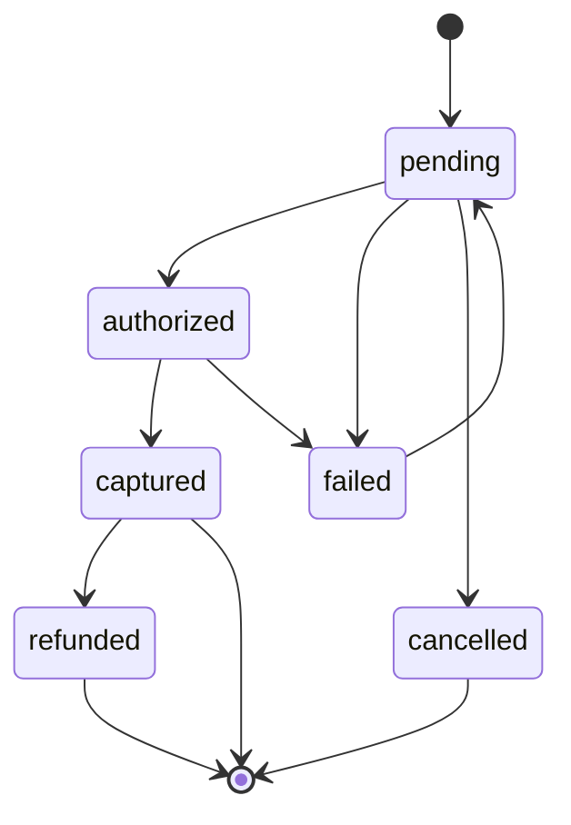
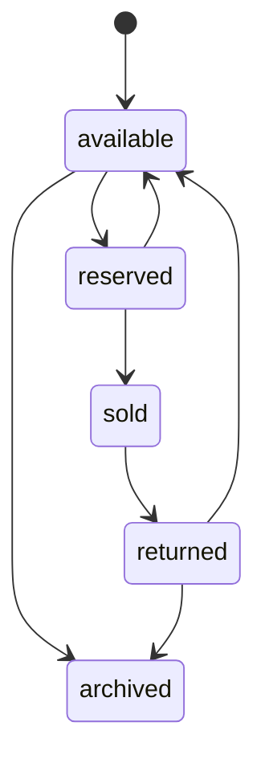
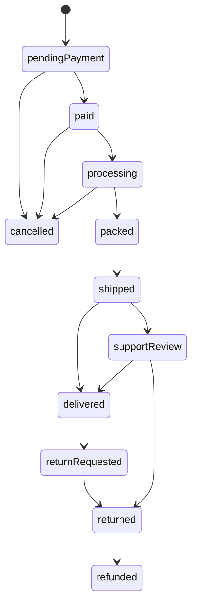

# AudioVintage User Workflows

This document describes the behavior the platform must support before it is
ready to accept real orders. Each workflow includes the expected path,
important alternatives, ownership, and the invariants that must hold.

## Workflow conventions

- The browser is an untrusted client.
- Every price, quantity, discount, address restriction, payment result, and
  order transition is revalidated by the API.
- A failed request must leave the system in a known state.
- Retry-safe operations use an idempotency key.
- Customer-facing messages explain what happened and what the customer can do
  next without exposing internal details.
- Every operational mutation has an actor, timestamp, target, outcome, and
  correlation ID in the audit trail.

## 1. Catalog discovery

**Actor:** Shopper  
**Goal:** Find a product and make an informed purchase decision.

### Primary path

1. Shopper lands on the homepage, a category, or the collection page.
2. Shopper searches, filters, sorts, or paginates the catalog.
3. The API returns only active products eligible for the configured market.
4. Shopper opens a product detail URL.
5. The page displays:
   - Product title and media
   - Price and currency
   - Availability
   - Condition grade
   - Cosmetic defects
   - Testing and restoration notes
   - Specifications and compatibility
   - Shipping and returns summary
6. Shopper adds the product to a cart or wishlist.

### Alternate paths

- No results: show the applied criteria, a clear reset action, and useful
  discovery alternatives.
- Product becomes unavailable: show that it is unavailable and do not add it
  to the cart.
- Product is removed after a previously cached page is opened: return a
  controlled not-found state.
- Search service or API is unavailable: show a recoverable error and do not
  show stale availability as current.

### Rules

- Search, filters, sort order, product cards, and product detail use the same
  catalog contract.
- A product URL must load correctly without Redux or `localStorage`.
- Product cards must not display an actionable add-to-cart control when the
  product is unavailable.

## 2. Guest cart

**Actor:** Guest shopper  
**Goal:** Collect products before checkout without creating an account.

### Primary path

1. Shopper adds an available product from a card, quick view, or detail page.
2. API creates or retrieves a secure anonymous cart.
3. API validates the product and requested quantity.
4. Cart displays the current product title, condition summary, price, quantity,
   line total, subtotal, and availability.
5. Shopper changes quantity, removes a line, or clears the cart.
6. Cart survives page refresh and follows the configured expiry policy.

### Rules

- There is one cart line per product or variant.
- Quantity is a positive integer and cannot exceed available stock.
- Unique vintage items normally have a maximum quantity of one.
- Cart prices are advisory until the server generates a current quote.
- Empty carts cannot start checkout.
- Repeated add requests do not create duplicate lines.
- Cart mutations are safe to retry.

## 3. Guest-to-account transition

**Actor:** Guest shopper becoming a customer  
**Goal:** Preserve shopping context while gaining account features.

### Primary path

1. Guest signs in or creates an account through the OIDC provider.
2. API verifies the identity and retrieves the customer profile.
3. Anonymous cart is merged into the customer cart.
4. Duplicate lines are combined subject to current stock limits.
5. Invalid or unavailable lines are reported without silently disappearing.
6. Customer continues checkout or reviews the merged cart.

### Rules

- The merge is atomic from the customer’s perspective.
- The customer cannot claim another customer’s cart or order.
- The server decides how conflicts are resolved.
- Repeating the merge request produces the same result.
- A guest order may be claimed only through an explicit verified flow.

## 4. Checkout and quote

**Actor:** Guest or authenticated shopper  
**Goal:** Receive a current total and submit a purchase.

### Primary path

1. Shopper starts checkout with a non-empty cart.
2. Shopper provides email, phone, billing address, and shipping address.
3. Shopper selects an eligible shipping method.
4. Shopper optionally enters a coupon.
5. API validates all input and calculates:

   ```text
   subtotal + shipping + tax - discount = total
   ```

6. API re-reads current product prices and inventory.
7. API returns a quote with currency, line items, expiry, and total in minor
   units.
8. Shopper confirms the payment method.
9. API creates a payment attempt and reserves inventory atomically.
10. Shopper is redirected to or interacts with the payment provider.

### Required failure behavior

- Invalid address: identify the field and preserve the entered form values.
- Unsupported shipping destination: explain the supported market.
- Invalid or expired coupon: keep the base quote and explain the coupon result.
- Price changed: show the changed line and require reconfirmation.
- Stock changed: remove or reduce the affected line only after explaining why.
- Quote expired: recalculate rather than charging the expired total.
- Payment provider unavailable: keep the order unpaid and provide retry guidance.

### Rules

- The browser never supplies authoritative prices or totals.
- Payment credentials never enter the AudioVintage database.
- The quote and payment attempt have an expiry policy.
- A customer must not be charged twice for one submission.

## 5. Payment and order creation

**Actor:** Payment provider and API  
**Goal:** Create exactly one durable order for a successful payment.

### Primary path

1. API creates a pending order or checkout session with an idempotency key.
2. API reserves inventory.
3. Payment provider authorizes or captures payment.
4. Provider sends a signed webhook.
5. API verifies signature, provider event identity, and replay status.
6. API marks the payment state from the provider-confirmed result.
7. API transitions the order to `paid` only once.
8. API commits the order line snapshots and fulfillment work.
9. Notification work is added to the outbox/queue.
10. Customer sees confirmation and receives an email.

### Payment state machine



### Rules

- A browser redirect is never proof of payment.
- Replayed webhooks are successful no-ops.
- Conflicting provider events are retained and investigated, not silently
  overwritten.
- Payment state and order/fulfillment state remain separate.
- Refunds record amount, reason, actor, provider reference, and timestamp.

## 6. Inventory reservation

**Actor:** API  
**Goal:** Prevent overselling during checkout.

### Primary path

1. API starts a database transaction.
2. API locks or conditionally updates the inventory record.
3. API confirms sufficient available quantity.
4. API creates a reservation with an expiry timestamp.
5. API creates the order/payment attempt.
6. On payment success, the reservation is converted into a sale.
7. On failure, cancellation, or expiry, the reservation is released.

### Inventory state machine



### Rules

- Reservation and quantity decrement are atomic.
- The same unique item cannot be reserved by two successful transactions.
- Expiry processing is retry-safe.
- An order retains the product and condition snapshot even if the catalog later
  changes.

## 7. Order access and post-purchase support

**Actor:** Customer or support administrator  
**Goal:** Safely view and operate an existing order.

### Guest access

1. Customer receives an order confirmation containing a secure access link or
   token.
2. Customer presents the token or completes order-number-plus-email
   verification.
3. API returns only the permitted order data.
4. Customer sees payment, fulfillment, tracking, and eligible next actions.

Predictable order IDs alone must never authorize access.

### Account access

1. Authenticated customer opens account orders.
2. API authorizes access against the customer identity.
3. Customer sees only their own orders.
4. Customer can request supported cancellation, return, or support actions.

### Fulfillment state machine



The exact transition policy is configured by business rules. Every forbidden
transition returns a conflict response and leaves the order unchanged.

## 8. Customer account management

**Actor:** Authenticated customer  
**Goal:** Manage identity-linked profile and order information.

- Sign in and sign out.
- Recover access through the identity provider.
- Update profile fields allowed by the application.
- Add, edit, and remove addresses.
- View owned orders.
- Merge a guest cart after sign-in.
- Claim a guest order through a verified email/token flow.

The API must authorize every resource by customer identity. Client-side route
guards are convenience only.

## 9. Returns, refunds, and damaged goods

**Actor:** Customer and operations administrator  
**Goal:** Resolve post-purchase issues consistently.

### Customer path

1. Customer selects an eligible order line.
2. Customer selects a reason and submits supporting information.
3. API checks policy, time window, order state, and previous requests.
4. API creates a return/support case.
5. Customer receives a case reference and next steps.

### Operations path

1. Administrator reviews the original order and immutable condition snapshot.
2. Administrator records inspection/evidence.
3. Administrator approves, rejects, or requests more information.
4. If approved, the administrator records return and refund actions.
5. Payment provider refund status is reconciled through provider responses.
6. Inventory is returned to sellable stock only after inspection.

No return or refund may directly rewrite the original order total.

## 10. Reviews, newsletter, and contact

### Reviews

1. Customer must prove purchase eligibility for the product.
2. Customer submits rating and content.
3. API validates length, content, and duplicate policy.
4. Review enters moderation.
5. Administrator approves, edits within policy, hides, or rejects it.

Reviews must be treated as untrusted user content and rendered safely.

### Newsletter

1. Visitor submits an email address.
2. API normalizes and validates it.
3. API records consent and source according to privacy policy.
4. Duplicate subscriptions are idempotent.
5. Unsubscribe must be available and effective.

### Contact

1. Visitor submits contact details and a message.
2. API validates and rate-limits the request.
3. API records the message and queues notification work.
4. Support receives a case/reference ID.
5. Logs and notifications redact unnecessary personal data.

## 11. Editorial content

**Actor:** Editorial contributor  
**System:** Sanity  
**Goal:** Publish trusted Listening Room content.

1. Contributor creates or updates an author and category.
2. Contributor creates an article draft.
3. Contributor supplies title, slug, excerpt, hero image, body, author,
   category, publication date, visibility, and optional SEO fields.
4. Sanity validates required fields.
5. Contributor reviews and publishes the article.
6. A static storefront build is triggered manually or automatically.
7. Build generates the article slug route.
8. Contributor verifies the public grid and detail page.

The public site must exclude drafts, internal articles, articles without valid
slugs, and articles without required presentation media.

## 12. Operations administration

**Actor:** Operations administrator  
**Goal:** Run the commercial lifecycle safely.

### Product and inventory

- Create a product with stable ID and slug.
- Add condition grade, testing/restoration evidence, specifications, media,
  price, currency, and stock.
- Archive rather than destroy historical products.
- Adjust inventory with a reason and audit record.
- Review active reservations and release expired reservations.

### Orders

- Search by secure order reference, customer, payment reference, or tracking
  reference.
- View the immutable order snapshot.
- Advance fulfillment only through permitted transitions.
- Add tracking.
- Record cancellation, return, refund, and support decisions.

### Promotions and shipping

- Create coupons with explicit validity, limits, stacking, and market rules.
- Configure shipping methods, eligibility, pricing, and service levels.
- Test a quote before activation.

### Access control

- Administrator actions require a role and permission.
- High-risk actions such as refunds, role changes, and bulk inventory changes
  require elevated permission and audit evidence.
- Support access to customer data is limited to the minimum required scope.

## Workflow acceptance checklist

Before a workflow is implemented, the team must be able to answer:

- Who is the actor and what authorizes them?
- What is the source of truth?
- What is the happy path?
- What happens on refresh, retry, timeout, duplicate submission, and concurrency?
- What states exist and which transitions are forbidden?
- What data must be immutable after the action?
- What personal or payment data is collected and how is it protected?
- What does the customer see for loading, empty, error, and recovery states?
- Which unit, integration, contract, E2E, security, and accessibility tests prove
  the behavior?
- What metrics, logs, alerts, and rollback actions are required?

